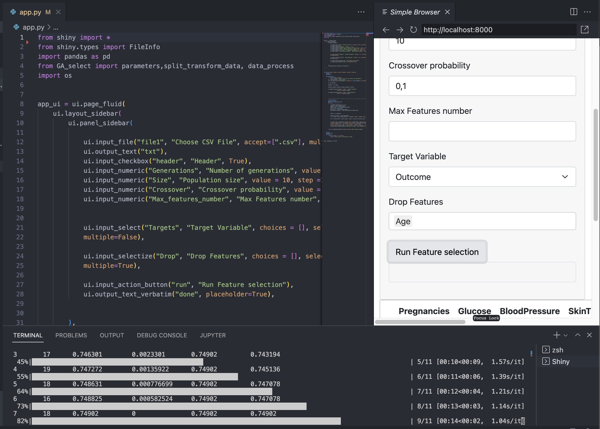

# Shiny GA feature selection


## Installation:

### First clone this repository:

    `git clone https://github.com/amgfernandes/shiny_GA_feature_selection.git`

### Then move inside the folder created:

    `cd shiny_GA_feature_selection`

### Create a new environment to install the app

- Example with new environment named `shiny_GA_feature_selection`

```
conda create -n shiny_GA_feature_selection python=3.9 -y

conda activate shiny_GA_feature_selection

conda install pip -y

pip install -r myapp/requirements.txt
 ```

### You can then run the Shiny app with the following:

`shiny run --reload myapp/app.py`

-  open a browser with following link: http://localhost:8000:

<br>


<br>

- or run inside VS Code:
<br>



<br>

### Alternatively you can use this web deployed version on Shinyapps.io:

- https://amgfernandes.shinyapps.io/shiny_ga_feature/

### deploy with: `rsconnect deploy shiny . --name amgfernandes --title shiny_ga_feature` 

